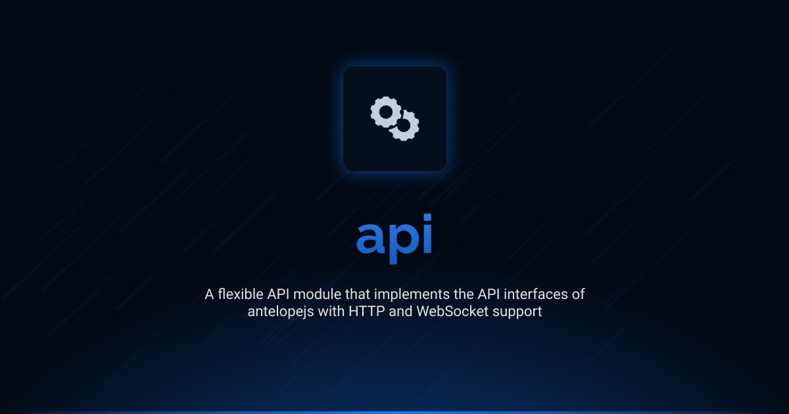

# @antelopejs/api

<div align="center">
<a href="https://www.npmjs.com/package/@antelopejs/api"></a>
<a href="./LICENSE"></a>
<a href="https://discord.gg/sjK28QHrA7"></a>
<a href="https://antelopejs.com/modules/api"></a>
</div>

A lightweight, flexible HTTP/WebSocket API module that implements the interface API of antelopejs.

## Installation

```bash
ajs project modules add @antelopejs/api
```

## Interfaces

This module implements the API interfaces who provide a HTTP framework with decorator controllers and middleware support. The interfaces are installed separately to maintain modularity and minimize dependencies.

| Name          | Install command                         |                                                              |
| ------------- | --------------------------------------- | ------------------------------------------------------------ |
| API           | `ajs module imports add api`            | [Documentation](https://github.com/AntelopeJS/interface-api) |

## Overview

The AntelopeJS API module provides a robust HTTP and WebSocket server implementation with a controller-based approach for building REST APIs and real-time applications. It supports:

- HTTP and HTTPS servers
- WebSocket connections
- Controller-based routing
- Parameter injection
- Middleware support
- CORS configuration

## Configuration

The API module can be configured with the following options:

```json
{
  "servers": [
    {
      "protocol": "http",
      "host": "localhost",
      "port": 8080
    },
    {
      "protocol": "https",
      "host": "localhost",
      "port": 8443,
      "cert": "path-to-cert",
      "key": "path-to-key"
    }
  ],
  "cors": {
    "allowedOrigins": ["https://example.com", "https://api.example.net"],
    "allowedMethods": ["GET", "POST", "PUT", "DELETE"]
  }
}
```

### Server Configuration

The module supports both HTTP and HTTPS servers. If no servers are configured, it defaults to HTTP on port 80.

Each server in the `servers` array can have the following properties:

- `protocol`: Either "http" or "https"
- `host`: (Optional) The hostname to bind to
- `port`: (Optional) The port to listen on
- Additional properties from Node.js http.ServerOptions or https.ServerOptions, such as `cert` and `key` for HTTPS

### CORS Configuration

The API module automatically adds a middleware for CORS support, which can be configured with:

- `allowedOrigins`: An array of allowed origins or regular expressions
- `allowedMethods`: An array of allowed HTTP methods

## License

This project is licensed under the Apache License 2.0 - see the [LICENSE](LICENSE) file for details.
