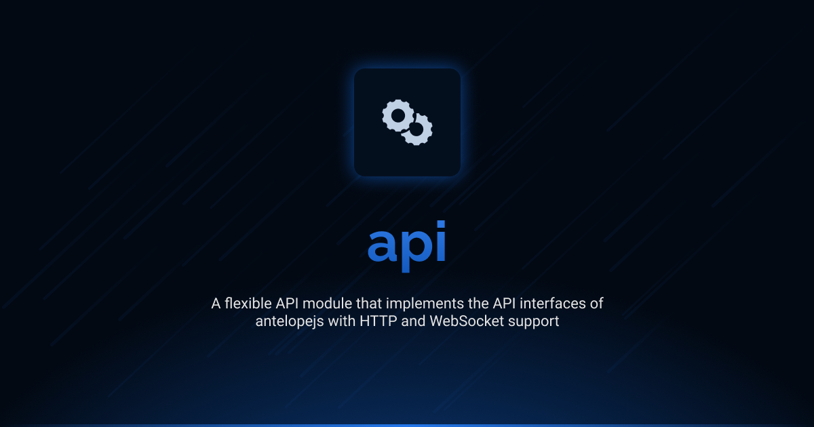

# @antelopejs/api

<div align="center">
<a href="https://www.npmjs.com/package/@antelopejs/api"></a>
<a href="./LICENSE"></a>
<a href="https://discord.gg/sjK28QHrA7"></a>
<a href="https://antelopejs.com/modules/api"></a>
</div>

A lightweight, flexible HTTP/WebSocket API module that implements the interface API of antelopejs.

## Installation

```bash
ajs project modules add @antelopejs/api
```

## Interfaces

This module implements the API interfaces who provide a HTTP framework with decorator controllers and middleware support. The interfaces are installed separately to maintain modularity and minimize dependencies.

| Name | Install command              |                                                              |
| ---- | ---------------------------- | ------------------------------------------------------------ |
| API  | `ajs module imports add api` | [Documentation](https://github.com/AntelopeJS/interface-api) |

## Overview

The AntelopeJS API module provides a robust HTTP and WebSocket server implementation with a controller-based approach for building REST APIs and real-time applications. It supports:

- HTTP and HTTPS servers
- WebSocket connections
- Controller-based routing
- Parameter injection
- Middleware support
- CORS configuration

## Configuration

The API module can be configured with the following options:

```json
{
  "publicBaseUrl": "https://api.example.com",
  "servers": [
    {
      "protocol": "http",
      "host": "localhost",
      "port": 8080
    },
    {
      "protocol": "https",
      "host": "localhost",
      "port": 8443,
      "cert": "path-to-cert",
      "key": "path-to-key"
    }
  ],
  "cors": {
    "allowedOrigins": ["https://example.com", "https://api.example.net"],
    "allowedMethods": ["GET", "POST", "PUT", "DELETE"]
  }
}
```

### Public Base URL

`publicBaseUrl` is the origin external clients — browsers — must use to reach this API. It is published as the `API_PUBLIC_BASE_URL` config variable and is meant for presigned asset URLs, CORS origins, redirect allowlists and e-mail links.

It is **required outside development**: when the runtime does not report `dev` and the key is missing, the module fails the boot with an explicit error instead of silently handing out `http://127.0.0.1:<port>` links. In development it defaults to `API_LOCAL_BASE_URL`, so local work needs no configuration at all.

### Server Configuration

The module supports both HTTP and HTTPS servers. If no servers are configured, it defaults to HTTP on port 80.

Each server in the `servers` array can have the following properties:

- `protocol`: Either "http" or "https"
- `host`: (Optional) The hostname to bind to
- `port`: (Optional) The port to listen on
- Additional properties from Node.js http.ServerOptions or https.ServerOptions, such as `cert` and `key` for HTTPS

### CORS Configuration

The API module automatically adds a middleware for CORS support, which can be configured with:

- `allowedOrigins`: An array of allowed origins or regular expressions
- `allowedMethods`: An array of allowed HTTP methods

In development (when the runtime reports `dev`), loopback origins — `localhost`, `127.0.0.1` and `[::1]`, on any port — are accepted automatically, with or without a `cors` block, so local frontends need no configuration. The request origin is reflected as-is, never `*`. In production, and for non-loopback development frontends (e.g. a LAN address), origins must be listed explicitly in `allowedOrigins`.

## Published Config Variables

The module publishes three [config variables](https://antelopejs.com/docs/concepts/configuration#module-config-variables) other modules reference from their own configuration with `${@api.<VAR_NAME>}`:

| Variable              | Type   | Description                                                                 |
| --------------------- | ------ | --------------------------------------------------------------------------- |
| `API_PORT`            | number | The port the server reserved during `provide`, and the port it later binds. |
| `API_LOCAL_BASE_URL`  | string | The same-host origin, always on loopback: `http://127.0.0.1:<API_PORT>`.    |
| `API_PUBLIC_BASE_URL` | string | The origin external clients must use, from the `publicBaseUrl` key.         |

All three derive from the **first entry of `servers[]`**, the same entry the dev registry and the frontend discovery already treat as the project's canonical api endpoint. Additional servers are still started, but they are not advertised through config variables.

```typescript [antelope.config.ts]
export default defineConfig({
  name: "my-project",
  modules: {
    api: { config: { servers: [{ protocol: "http", port: 8080 }] } },
    "file-storage-local": {
      config: { baseUrl: "${@api.API_PUBLIC_BASE_URL}/assets" },
    },
  },
});
```

### Port reservation

The variables are published from the `provide` callback, which the core runs before any module constructs.

To publish a port it can guarantee, the module reserves it right there: it binds a throwaway socket on the configured port, holds it while every other module constructs, and releases it immediately before the real `listen()` in `start`. The value other modules receive is therefore the port the server actually binds — never a stale one.

The reservation honours the existing port rules:

- `strictPort: true`, or any non-development runtime, reserves exactly the requested port or fails the boot with a `PortReservationError` naming the port.
- In development, the reservation falls back to the next free port (up to 20 above the requested one, then an OS-assigned port), exactly as `listen()` did before.
- `port: 0` reserves an OS-assigned port and publishes it.

### One advertised origin

The module names itself in exactly one way. The host recorded in `.antelope/dev.json` and the host in `API_LOCAL_BASE_URL` go through the same derivation, so a browser is never handed the same server under two spellings — `localhost` and `127.0.0.1` are distinct origins to it, worth a second preflight and a second cookie jar.

The bind host becomes a connectable URL host as follows:

- an absent or wildcard host (`0.0.0.0`, `::`, `[::]`) becomes `127.0.0.1`, because a wildcard is not a connectable address. `127.0.0.1` is used rather than `localhost`, which goes through the resolver and may answer `::1` — an address an IPv4-bound server does not listen on;
- any explicit host — `localhost`, a LAN address, a name — is preserved verbatim, because a server bound to it does not listen on loopback at all;
- a bare IPv6 literal is bracketed, as a URL requires.

The scheme follows the first server's `protocol`, so an HTTPS-first setup is never advertised as `http://`. The same origin is what the startup log prints.

## License

This project is licensed under the Apache License 2.0 - see the [LICENSE](LICENSE) file for details.
